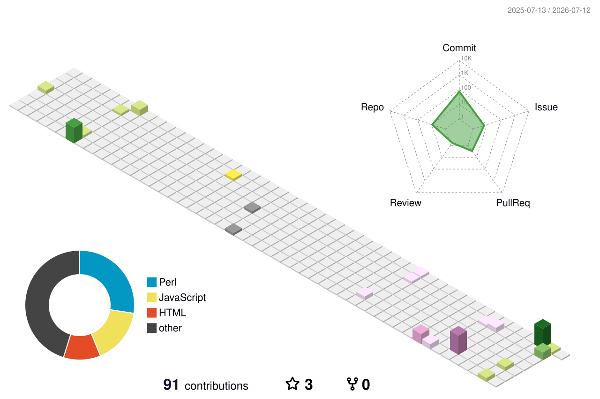

<!-- Typing SVG header -->

---

### About me

I work as a Project Associate at [CSIR-IGIB](https://www.igib.res.in/), New Delhi, in the INGEN-HOPE Lab under Dr. Rajesh Pandey. Most of my day involves wrangling long-read sequencing data on HPC clusters — building and running pipelines for dengue surveillance, drug-resistant bacterial genomes, and whatever else comes off the Nanopore.

Before that: M.Sc. bioinformatics, some immunoinformatics work on HBV vaccines, structural biology. The work has slowly shifted from wet-lab-adjacent analysis toward full pipeline development, and I want to keep going in that direction. Currently applying to computational biology PhD programs in Europe, Singapore, and Australia.

- 🧬 Working on ONT-based WGS for clinical *A. baumannii* and dengue surveillance
- 🤖 Picking up foundation models for genomics — DNABERT, Nucleotide Transformer, HuggingFace ecosystem
- 🌍 Trained at the WHO SEARO Dengue WGS Workshop (March 2026) as a bioinformatics trainer
- 📬 Always open to talk about computational biology, sequencing pipelines, or PhD apps

---

### Tech I use

**Sequencing & Genomics:** Oxford Nanopore (MinION/GridION), nf-core/bacass, nf-core/viralrecon, Medaka, Flye, MAFFT, BEAST, Augur, Biopython  
**Analysis:** NanoPlot, MultiQC, Bandage, AMRFinderPlus, ResFinder, MLST  
**ML/AI for Bio:** DNABERT-2, Nucleotide Transformer, PyTorch, scikit-learn

---

### GitHub stats

---

### 3D contribution graph

---

### Find me

---

Profile views: 

